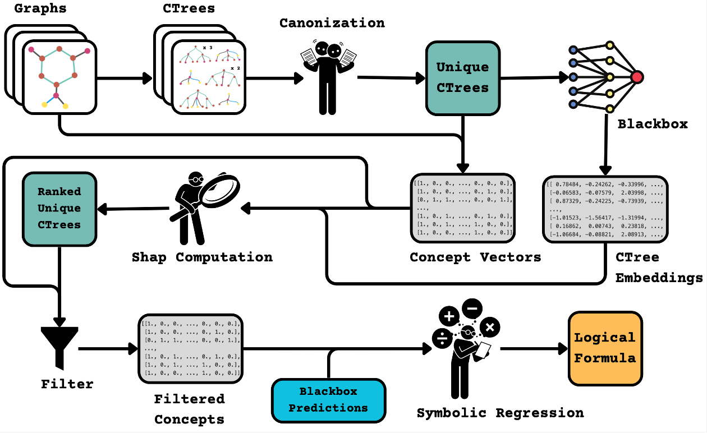

# GraphTrail: Translating GNN Predictions into Human-Interpretable Logical Rules

This is the official repository of [GraphTrail](https://openreview.net/pdf?id=fzlMza6dRZ) accepted at NeurIPS 2024.

To cite our work, use:
```
@inproceedings{armgaangraphtrail,
  title={GraphTrail: Translating GNN Predictions into Human-Interpretable Logical Rules},
  author={Armgaan, Burouj and Dalmia, Manthan and Medya, Sourav and Ranu, Sayan},
  booktitle={The Thirty-eighth Annual Conference on Neural Information Processing Systems}
}
```



# Environment

`GraphTrail.yml` is a frozen GPU export (PyTorch 1.13.1, CUDA 11.7). Create the environment with:
```bash
conda env create -f GraphTrail.yml
conda activate GraphTrail

cd src/
rm -rf pygcanl/build/ pygcanl/pygcanl.egg-info/ pygcanl/*.so
pip install -e pygcanl --no-build-isolation
```

If `conda env create` fails, install step by step instead:
```bash
cd src/

conda create -n GraphTrail python=3.10 -y
conda activate GraphTrail
conda clean -a -y

conda install pytorch==1.13.1 torchvision==0.14.1 torchaudio==0.13.1 pytorch-cuda=11.7 -c pytorch -c nvidia -y
conda install pyg -c pyg -y
conda install -c conda-forge shap multiprocess -y
conda install networkx matplotlib seaborn ipykernel ipywidgets -y

pip cache purge
pip install pysr

conda install conda-forge::boost gxx_linux-64 -y

# Pin MKL to avoid a PyTorch 1.13.1 import error on newer conda defaults
conda install mkl=2023.1.0 intel-openmp=2023.1.0 -y

rm -rf pygcanl/build/ pygcanl/pygcanl.egg-info/ pygcanl/*.so
pip install -e pygcanl --no-build-isolation
```

For a CPU-only setup, replace the PyTorch line with:
```bash
conda install pytorch==1.13.1 torchvision==0.14.1 torchaudio==0.13.1 cpuonly -c pytorch -y
```

# Run the code
```bash
cd src/

# Generate training, validation, and test indices for all datasets.
python gen_indices.py

# Train GNN if not already trained.
python train_gnn.py -h
python train_gnn.py ...

# Identify the unique computation trees and create the concept vectors.
python gen_ctree.py -h
python gen_ctree.py ...

# Compute the Shapley values of the computation trees identified in gen_ctree.py
pythopn gen_shap.py -h
python gen_shap.py ...

# Generate formulae over the ctrees identified by gen_shap.py
# You will see some Julia installation on your first run.
python gen_formulae.py -h
python gen_formulae.py ...
```

## Example
```python
cd src/

python gen_indices.py

python train_gnn.py --name MUTAG --arch GIN

python gen_ctree.py --name MUTAG --arch GIN

python gen_shap.py --name MUTAG --arch GIN

python gen_formula.py --name MUTAG --arch GIN
```

# Data
The code will generate some intermediate files and save them under the following directory structure:
```bash
data
├── BAMultiShapesDataset
│   ├── GAT
│   │   ├── add
│   │   │   ├── 0.05
│   │   │   │   ├── 357
│   │   │   │   │   ├── test_indices.pkl
│   │   │   │   │   ├── train_indices.pkl
│   │   │   │   │   └── val_indices.pkl
│   │   │   │   ├── 45
│   │   │   │   │   ├── test_indices.pkl
│   │   │   │   │   ├── train_indices.pkl
│   │   │   │   │   └── val_indices.pkl
│   │   │   │   └── 796
│   │   │   │       ├── test_indices.pkl
│   │   │   │       ├── train_indices.pkl
│   │   │   │       └── val_indices.pkl
```
